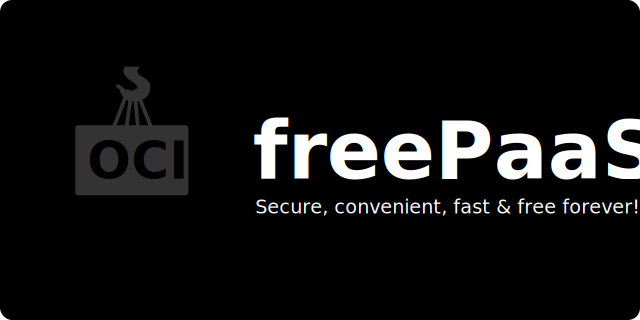

<p align="center">

</p>

# freePaaS — Secure, convenient, fast & free forever!

Production ready services fully managed on a RaspberryPi (or any other machine):

- Lightweight runtime containers (Python, Nodejs, etc)
- Databases (PostgreSQL, Redis, etc)
- Automatic HTTPS with Let's Encrypt
- Monitoring & Logging
- Durability & Backups

No fuss automatic deployments straight form GitHub.

## Getting Started

```
curl -fsSL https://raw.githubusercontent.com/codingjoe/python-container/main/bin/install.sh | sh
```

```bash
# Dev
docker compose up -d
```

## Features

- Use tiny [Distroless] images for production
- High availability setup with multiple web servers behind a load balancer
- Automatic HTTPS with Let's Encrypt via [Caddy]
- [PostgreSQL] database with daily backups
- [Redis] for caching and co
- Install Python version and it's dependencies using [uv]

## Roadmap

- [x] Add [Python] runtime container
- [x] Add [Nodejs] runtime container
- [x] Add [PostgreSQL] service
- [x] Add [Redis] service
- [x] Add automatic HTTPS with [Caddy]
- [x] Add log draining service [Dozzle]
- [x] Add load balancer for web services w/ [Caddy]
- [ ] Persist Dozzle logs for 30 days
- [ ] Add logical backup service for [PostgreSQL]
- [ ] Add message broker service (e.g. RabbitMQ)
- [ ] Add monitoring container monitoring
- [ ] Add monitoring for data stores

[caddy]: https://caddyserver.com/
[distroless]: https://github.com/GoogleContainerTools/distroless
[postgresql]: https://www.postgresql.org/
[redis]: https://redis.io/
[uv]: https://docs.astral.sh/uv/
