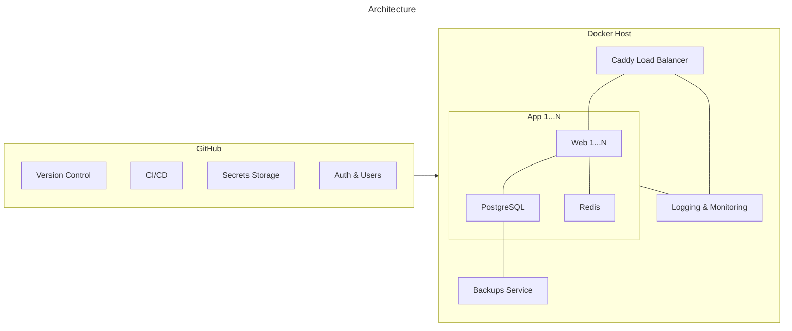

<p align="center">

</p>

# freePaaS — Secure, convenient, fast & free forever!

Production ready services fully managed on a RaspberryPi (or any other machine):

- [12-factor] app principles
- continues deployment
- environment & key management
- managed databases ([PostgreSQL], [Redis])
- managed [updates & security alerts][dependabot]
- monitoring & [logging][dozzle]
- SSL via [Let's Encrypt][letsencrypt]
- [Python] & [Node.js] support (more languages coming soon)

No config, no costs, just GitHub and your own server.

## Getting Started

```
bash <(curl -fsSL https://raw.githubusercontent.com/codingjoe/freePaaS/main/bin/install.sh)
```

The installer will guide you through the setup process and get your first application up and running in seconds!

## How it works



freePaaS uses a GitOps approach to deploy and manage your applications. GitHub is used as the single source of truth for application code, configuration, and secrets and authentication for staff.
The [Docker] host runs the applications in lightweight containers, managed by Docker Compose. A [Caddy] load balancer handles incoming traffic, providing automatic HTTPS and routing requests to the appropriate web servers. Each application has its own PostgreSQL database and Redis instance for caching.

[12-factor]: https://12factor.net/
[caddy]: https://caddyserver.com/
[dependabot]: https://github.com/dependabot
[docker]: https://www.docker.com/
[dozzle]: https://dozzle.dev/
[letsencrypt]: https://letsencrypt.org/
[node.js]: https://nodejs.org/
[postgresql]: https://www.postgresql.org/
[python]: https://www.python.org/
[redis]: https://redis.io/
